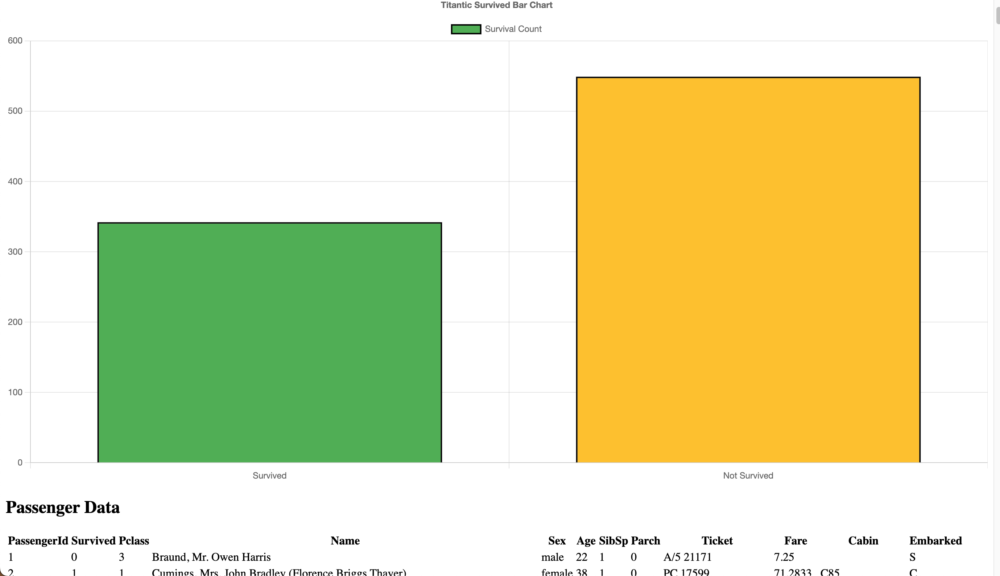

# AXA Full stack project
---------------




## How to start

To start the project, You need to have docker preinstalled. Please run this command to start the project.

```
docker-compose up --build
```

## The app contains

- Frontend using React
    - A upload button (please upload the ```train.csv``` that is in the same directory with this ```README```).
    - A simple graph.
    - A table to represent all the data from the dataset.
- Backeng using Flask
    - Passenger model for database.
    - Fetch data API.
    - Load in data API.
- Postgres for database
- Docker compose and dockerfile